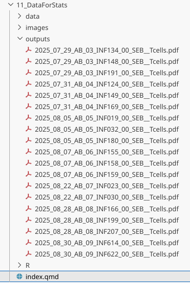
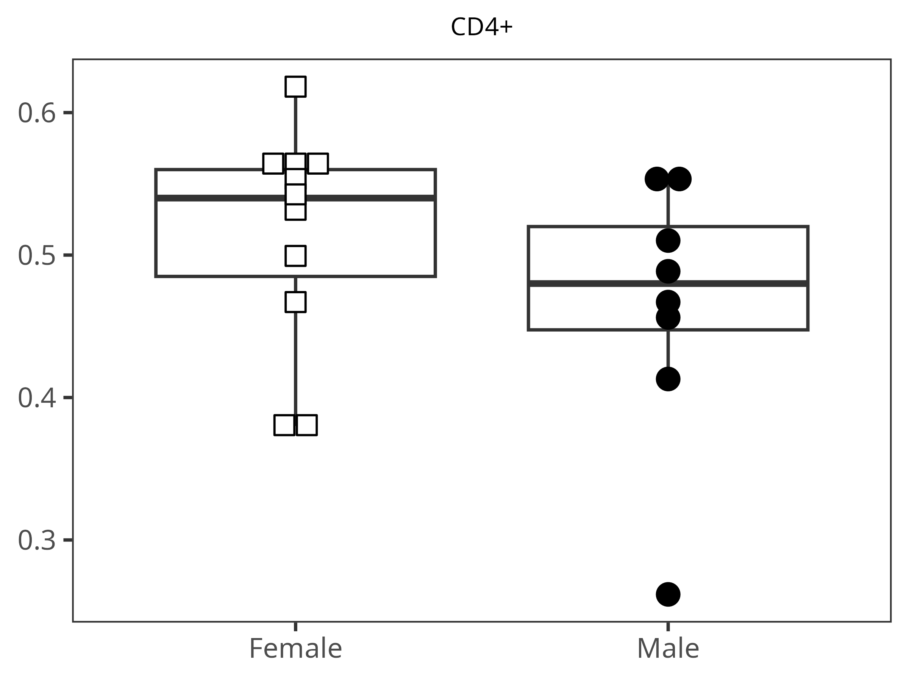
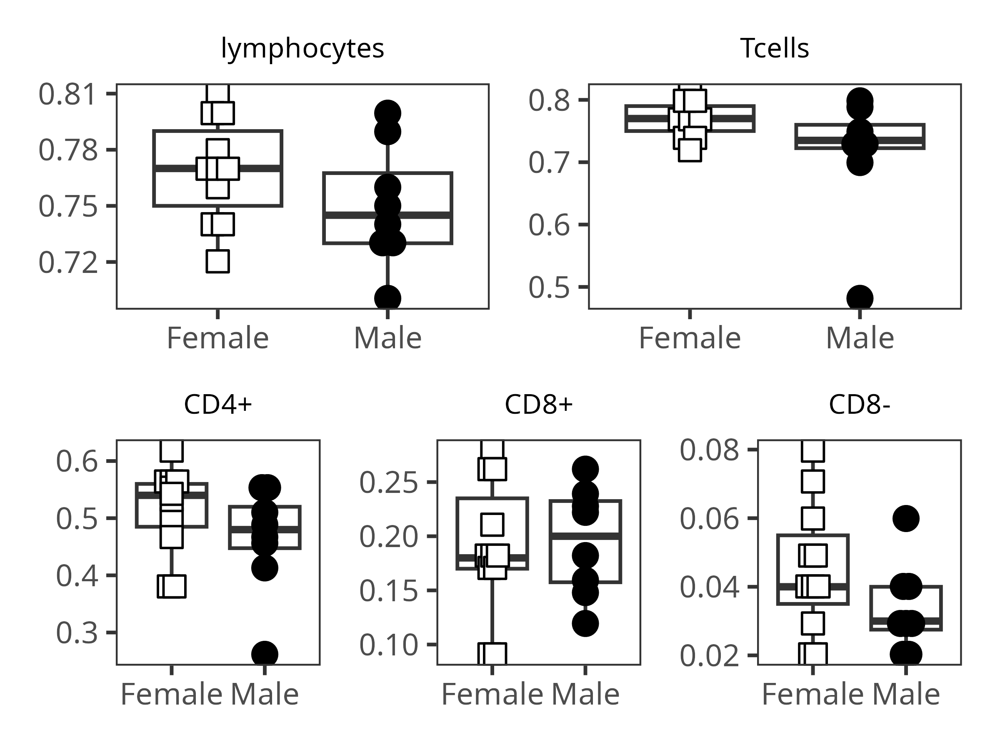

::: {style="text-align: right;"}
[](https://www.gnu.org/licenses/agpl-3.0.en.html) [](http://creativecommons.org/licenses/by-sa/4.0/)
:::

For the YouTube livestream schedule, see [here](https://www.youtube.com/@cytometryinr)

For screen-shot slides, click [here](/course/03_InsideFCSFile/slides.qmd)

<br>

---

# Background

Welcome back to Cytometry in R! At this point of the course, we have explored substantial portions of how to implement in R a typical supervised (i.e. manual-gating) workflow for cytometry data. One important area of this workflow, however, remains absent, namely, the segment running from data retrieval, through statistical analysis and creating figures. 

If you are coming from a "typical" immunology background, it's typically at this point of the workflow where you export your data out from your commercial software to an excel file, tidy column names by hand, then spend a substantial amount of time copying and pasting the data over into a commercial statistical analysis software, where you can run specific test, and then generate some plots showing the relative data and p-values.

Fortunatley, R at it's core is a statistical programming language, which means we can immensely simplify this process, substantially reducing the time and effort it takes to go from gated cell populations to publication ready plots.

In this session, we will explore how to retrieve summary statistics from the gates in our [GatingSet](/course/05_GatingSets/index.qmd), how to ["tidy"](https://vita.had.co.nz/papers/tidy-data.pdf) these outputs and combine them with metadata to fascilitate statistical analysis and plotting. We will also continue practicing building [functions](/course/09_Functions/index.qmd) and leveraging [functional programming](https://modern-rstats.eu/functional-programming.html) principles to speed up our analyses through iteration. 

What this session is not however is a lesson in statistics. This is not a statistics course, I am not a statistican, nor do I pretend to be. 

For those who are interest in the subject, I  do highly recommend two separate resources for those of you who are interested in the topic.

- [Modern Statistics for Modern Biology](https://web.stanford.edu/class/bios221/book/00-chap.html) by Susan P. Holmes and Wolfgang Huber. Really well thought out, beginner friendly, and all their examples are in R. 

- [Statistical Rethinking](https://youtu.be/ztbYkBPDOgU?si=7g_3wwgpg0Xs9mRe) by Richard McElreath. For a more outside Bayesian perspective, very much a gentle introduction to modeling course. 

Likewise, just because R will allow you to rapidly crank out all comparisons and return anything with a p-value < 0.05 [doesn't mean](https://pubmed.ncbi.nlm.nih.gov/27209009/) the variable is actually relavant. Science as a whole still has a reproducibility crisis, and statistical test remain exactly that, test, the hard-work of understanding complex biology remains.

# Walk Through

:::{.callout-important title="Housekeeping"}
As we do [every week](/course/02_FilePaths/index.qmd), on GitHub, [sync](/course/00_Homeworks/index.qmd#sync-your-fork) your forked version of the CytometryInR course to bring in the most recent updates. Then within Positron, [pull](/course/00_Homeworks/index.qmd#pull-to-local) in those changes to your local computer. 

For YouTube walkthrough of this process, click [here](https://www.youtube.com/live/Zfctacqpe90?si=a7Ad61kj6_UDNkGw&t=32)

After [setting up](/course/00_Git/index.qmd#new-folder-from-template) a "Week10" project folder, copy over the contents of "course/10_Downsampling/data" to that folder. This will hopefully prevent merge issues next week when attempting to pull in new course material. Once you have your new project folder organized, remember to [commit](/course/00_Git/index.qmd#push) and push your changes to GitHub to maintain remote version control. 

If you encounter issues syncing due to the Take-Home Problem merge conflict, see this [walkthrough](https://umgcccfcsr.github.io/CytometryInR/course/00_BonusContent/PullConflicts/). The updated homework submission protocol can be found [here](https://umgcccfcsr.github.io/CytometryInR/course/00_BonusContent/PullConflicts/UpdatedPullRequest)
:::

## Setup

### GatingSet

As always, lets start by loading our data into a GatingSet, first by loading in our libraries

```{r}
library(flowWorkspace)
library(dplyr)
library(ggplot2)
library(ggcyto)
library(openCyto)
library(purrr)
```

And while we are attaching packages containing functions to our local environment, we might as well go ahead and add the functions we created over the last two sessions as well. To do so, lets combine the `walk()` and `source()` to iterate through the contents of the new R folder in our working directory. 

```{r}
#| eval: FALSE

# RFolder <- file.path("course", "11_DataForStats", "R") # For Interactive
RFolder <- file.path("R") # For Quarto Rendering
MyFunctions <- list.files(RFolder, full.names=TRUE)
purrr::walk(.x=MyFunctions, .f=source)
```

Next, lets locate our ,fcs files and assemble our GatingSet. The .fcs files we will be using today can be found on ImmPort [SDY3080](https://immport.org/shared/study/SDY3080), and have been downsampled to 10000 live T cells for each file to accomodate the GitHub file size liits. 

```{r}
StorageLocation <- file.path("data") # For Quarto Rendering
# StorageLocation <- file.path("course", "11_DataForStats", "data")

OutputFolder <- file.path("data") # For Quarto Rendering
# OutputFolder <- file.path("course", "11_DataForStats", "outputs")

fcs_files <- list.files(StorageLocation, pattern=".fcs", full.names=TRUE)

SFC_cytoset <- load_cytoset_from_fcs(fcs_files, truncate_max_range=FALSE, transformation=FALSE)
SFC_GatingSet <- GatingSet(SFC_cytoset)
SFC_cytoset <- load_cytoset_from_fcs(fcs_files, truncate_max_range=FALSE, transformation=FALSE)
SFC_GatingSet <- GatingSet(SFC_cytoset)
```

Next, we can proceed to apply our desired transformation parameters to the fluorophore channels.

```{r}
SFC_Parameters <- colnames(SFC_GatingSet)
FluorophoresOnly <- SFC_Parameters[!stringr::str_detect(SFC_Parameters, "FSC|SSC|Time")]

Biexponential <- flowjo_biexp_trans(channelRange=4096, maxValue=262144,
     pos=4.5, neg=2, widthBasis=-750)
MyBiexTransform <- transformerList(FluorophoresOnly, Biexponential)
transform(SFC_GatingSet, MyBiexTransform)
```

### Metadata

And since we are going to be doing statistical analyses, lets go ahead and bring in metadata from the associated .csv file inside the data folder and attach it to our GatingSet metadata. Please note, some small renaming was needed, as the original .fcs file had extra zeros in the specimen name (ex. INF00100, instead of INF100), which would have prevented `left_join()` from merging the two data.frames together correctly by the shared column. 

```{r}
CurrentMetadata <- pData(SFC_GatingSet)
CurrentMetadata <- CurrentMetadata |> mutate(specimen = name) |>
     mutate(specimen = stringr::str_extract(specimen, "INF\\d+")) |>
     mutate(specimen = stringr::str_replace(specimen, "INF0(\\d{3})", "INF\\1"))

TheCSV <- list.files(StorageLocation, pattern="Metadata.csv", full.names=TRUE)
AdditionalMetadata <- read.csv(TheCSV, check.names=FALSE)
AdditionalMetadata <- AdditionalMetadata|>
     mutate(specimen = stringr::str_replace(specimen, "INF0(\\d{3})", "INF\\1"))
```

With the specimen column now containing names that match each other in both data.frames, lets combine them with `left_join()` and then assign back to the GatingSet metadata via `pData()`

```{r}
UpdatedMetadata <- left_join(CurrentMetadata, AdditionalMetadata, by="specimen")
rownames(UpdatedMetadata) <- UpdatedMetadata$name
pData(SFC_GatingSet) <- UpdatedMetadata
pData(SFC_GatingSet)
```

### openCyto gates

Over the last two sessions, we have been mainly using `flowGate` when setting up our GatingSets. Let's switch things up by using `openCyto` to instead implement automated style gates, since it has been a bit since we last did this back during [Week 08](/course/08_WaysToGate/index.qmd). 

Fot the `openCyto` template, since all these fcs files were already exported out as new downsampled .fcs files at the level of "live Tcells", I will just add some basic "min_density" gates to identify the main T cell populations, and some cytokines (TNFa, IFNg, IL-2). Remember, these specimens are cord blood specimens that were stimulated with [SEB](https://en.wikipedia.org/wiki/Enterotoxin_type_B), so we would anticipate more muted cytokine responses than what we would see in adults, primarily in CD4 and CD8 T cells. 

```{r}
OurGateTemplate <- list.files(StorageLocation, pattern="GatesUnmixed.csv", full.names=TRUE)
Example <- read.csv(OurGateTemplate, check.names=FALSE)
```

```{r}
Example
```

Lets go ahead and apply the gates. 

```{r}
#| warnings: FALSE

# install.packages("data.table") # CRAN
GatesToApply <- data.table::fread(OurGateTemplate)

TheFullTemplate <- gatingTemplate(GatesToApply)

gt_gating(TheFullTemplate, SFC_GatingSet)
```

### Luciernaga

Previously, we used `ggcyto` `autoplot()` to [visualize](/course/08_WaysToGate/index.qmd) the applied gates. This generic approach however had several issues, including not being able to zoom in and visualize things appropiately. After encountering issues back in 2023, I got irritated enough with it, that I wrote [several]() functions to provide some additional tools for use when trying to validate whether the gates were applied correctly. 

These are currently available via the [`Luciernaga`](https://davidrach.github.io/Luciernaga/articles/DataVisualization.html) package, which we are in the process of wrapping up documentation for before [submitting](https://contributions.bioconductor.org/bioconductor-package-submissions.html) to Bioconductor. For these examples, I will also link to the corresponding R file, in case you want to modify the function further for your own use cases. 

```{r}
# remotes::install_github("DavidRach/Luciernaga")
library(Luciernaga)
```

#### GatingPlots

Lets first double check to make sure the applied gates look reasonable, examining just the first specimen in our GatingSet. We can do this via [`Utility_GatingPlots()`](https://github.com/DavidRach/Luciernaga/blob/main/R/Utility_GatingPlots.R), which references our read-in openCyto gating template. We can return the condensed plots to R using returnType set to "patchwork"

```{r}
#| warning: FALSE
IndividualPlot <- Utility_GatingPlots(x=SFC_GatingSet[[1]],
 sample.name = "GUID", removestrings = ".fcs", gtFile = GatesToApply,returnType="patchwork")
IndividualPlot
```

So for this one specimen it looks like the gates were correctly applied, with no obvious single populations ending up being split. But what if we want to screen all specimens in our GatingSet? We can use `purrr` to iterate through the GatingSet, and modify returnType to "pdf", allowing us to return pdfs for each specimen, which we can in turn check to see if everything was gated appropiately. 

```{r}
#| eval: FALSE
purrr::walk(.x=SFC_GatingSet, .f=Utility_GatingPlots, sample.name = "GUID", removestrings = ".fcs", gtFile = GatesToApply,returnType="pdf", outpath=OutputFolder)
```



In a situation where the `openCyto` gates messed up, we can update the gate_range arguments for that particular gate row within GatesUnmixed.csv, then rerun everything and check again. This process can then be repeated until you are happy with all the gates across all specimens. This is particularly important today, as we will be using the outputs for statistics. 

#### UnityPlots

Another `Luciernaga` visualization plot is the [`Utility_UnityPlot()`](https://github.com/DavidRach/Luciernaga/blob/main/R/Utility_UnityPlots.R), which can allow us to compare across all specimens that are present in the GatingSet in the same view. In the example below, we can compare Tregs within the CD4+ cells by comparing CD25 and FoxP3. 

```{r}
Plot <- Utility_UnityPlot(x="PE-Fire 744-A", y="Alexa Fluor 488-A",
 GatingSet=SFC_GatingSet, sample.name="GUID", bins=70,
 removestrings=".fcs", marginsubset="Tcells", gatesubset="CD4+", returntype="patchwork", reference=NULL, clearance=0.2, gatelines=FALSE)

Plot
```

When setting `openCyto` gate_range constraints, this can help evaluate whether the numbers provided will be appropiate across specimens.

#### RidgePlots

Another visualization we can attempt when determining "gate_range" arguments is the []`Utility_RidgePlots()`](https://github.com/DavidRach/Luciernaga/blob/main/R/Utility_RidgePlots.R), which can quickly return ridge style plots, which can also be filled in based on the metadata columns. 

```{r}
# pData(SFC_GatingSet)

SinglePlot <- Utility_RidgePlots(gs=SFC_GatingSet, subset="CD8+", 
     TheFill="infant_sex", TheX = "APC-Fire 750-A", TheY="specimen",returntype="patchwork", outpath=OutputFolder, 
     filename="RidgePlot_Condition")

SinglePlot
```

As you may notice, while we can view the main differences, especially when there are many ells present, the positive cells can appear drowned out and end up hugging their individual axis compared to the negative cells. 

#### NxNPlots

And last of the additional visualization plot functions for today, the []`Utility_NxNPlots](()` returns a 1xN style plot for a given specimen. This is particularly useful both in context of evaluating unmixing, but also in determining the gate_range arguments for all various markers for individual specimens. I will generally use this when first setting up my gate_range arguments for individual markers when setting up a brand new `openCyto` template. 

```{r}
Utility_NbyNPlots(x=SFC_GatingSet[[1]], sample.name = "GUID", 
    removestrings = ".fcs", marginsubset = "Tcells",
    gatesubset = "CD4+", ycolumn = "Spark Blue 550-A", bins = 70,
    returntype="patchwork")
```

### Validation

All in all, for these specific gates, and markers being evaluated, everything looks to be gated well enough to move on. Remember however, that missed-set gates at this stage will impact the frequencies and counts you get out from your own datasets, so any extra time spent validating visually is time well spent. 

This is particularly true for spectral flow cytometry data, where variation in unmixing at this stage can result in shifts in where the MFI for the negative and positive populations start and end. While `openCyto` is able to account for this somewhat, if our `gate_range` arguments are too constrained for an individual specimen, they will not be flexible enough to allow for adjustments for the other specimens. So as in everything flow cytometry analysis, it is a balance of competing interest. 

## Tidy Data

Now that we are reasonably happy with the gates applied to our .fcs files, we can proceed on and focus on retrieving the counts/frequencies for each gate. These in turn we will need to "tidy" up a bit, and make sure the metadata is arranged correctly to make subsequent steps a little easier to implement

### Data Retrieval

Remembering back to [Week 05]() and sporadically throughout the function building weeks, we have used the `gs_pop_get_count_fast()` function to retrieve from the GatingSet the counts for our individual gates. In this case, we also want to grab the associated metadata stored in `pData()`, so we will go with the sister function `gs_pop_get_count_with_meta()`. Likewise, lets return the "frequency", instead of the count, to avoid an extra calculation step if we has used the "count" default. 

```{r}
Data <- gs_pop_get_count_with_meta(SFC_GatingSet, "freq")
```

At this point we can carry out several data tidying steps (keeping just gate name for Population, rounding the frequency, etc.) before removing a few extraneous columns that we will not be using for our subsequent analysis. 

Additionally, it is important that we `relocate()` the metadata columns from the right side of our data.frame, to the left side, the reasons for which will become more obvious as we move through our analysis today. 

```{r}
# colnames(Data)
Data$Population <- basename(Data$Population)
Data$Frequency <- round(Data$Frequency, 2)

RemoveTheseColumns <- c("Parent", "ParentFrequency", "name", "sampleName")

Data <- Data |> select(!tidyselect::any_of(RemoveTheseColumns))
Data <- Data |> relocate(specimen, Condition, timepoint, ptype, infant_sex, .before=Population)
```

### pivot_wider

```{r}
head(Data, 5)
```

From our currently tidyed data, we can tell that while better, it is still a little  unwiedly at this point, as we have a data.frame that is rather long (with each gate observation corresponding to an individual row). For many of the statistical test we will use, the expectatrion is that an individual comparison occupy a single column, with the rows representing individual observations for each specimen. 

Consequently, we need to remodel this existing data.frame, converting from a "long" style data.frame to a "wide" format, so that these rows containing individual bits of information get converted into their own designated columns to maintain a tidy format. 

To this, we will be using the `tidyr` package. The two functions we will most frequently use in this course are the `pivot_wider()` and `pivot_longer()` functions, which mediate these exact types of interconversions. 

Lets start by loading in the package

```{r}
# install.packages("tidyr") #CRAN
library(tidyr)
```

```{r}
Data <- Data |> pivot_wider(names_from=Population, values_from = Frequency)
```

```{r}
head(Data, 3)
```

With the data now "tidy", we are able to move on and start learning how to run statistical test in R. 

## Statistics

### Some Context

Overly simplifying here,  when we are working with flow cytometry data:

- We are typically working with frequencies (count of cell type of interest / count of parent gate).

- Generally, we are comparing differences in these frequencies across 2 or 3 groups of interest

- And our choice of statistical test is often dictated on whether we expect the data to be normally distributed (i.e. parametric) or not (i.e. non-parametric)

Consequently, we typically encounter the following statistical test

- t-test (for 2 groups, normally distributed, using means)
- One-Way Anova (for 3 groups, normally distributed, using means)
- Wilcox (for 2 groups, not normally distrubuted, using medians)
- Kruskal-Wallis (for 3 groups, not normally distrubuted, using medians)

Obviously, this is a generalization. Statistics as a field didn't end in the early 1900s after these four test were invented, the assumptions, exceptions, edge-cases, etc. have kept our statistician friends quite busy for the past century. 

One useful way of contextualizing the differences is this [chart and blogpost](https://lindeloev.github.io/tests-as-linear/) made by Jonas Kristoffer Lindeløv that occasionally circulates around academic circles, illustrating the point that most of these test are essentially just representing linear models. 

[](https://lindeloev.github.io/tests-as-linear/linear_tests_cheat_sheet.png)

Consequently, many of the R statistical test syntax follows this same "y=mx+b" arguments when it comes time to providing inputs. We typically need to provide the following elements to various argument

- data (the data.frame or tibble)
- A response variable (the column of data with the measurements we are analyzing)
- A grouping variable (the column with the factor/groups we are contrasting across)
- Additional arguments specifying certain test condition behaviors. 

With this context, lets get started and figure out how to run our first t-test in R. 

### Getting Setup

First off, lets refresh our memory of what our data looks like

```{r}
head(Data, 3)
```

We are starting off with several metadata columns, at which point we are transitioning over to measurement columns

```{r}
colnames(Data)
```

For a statistical test expecting a "data", "response" variable, and "grouping" variable, we could provide Data to the "data" argument, and the corresponding column name to "response" and "grouping". 

Of our potential "grouping" variables, with this dataset, we have both "infant_sex", and "ptype" (corresponding to neonate [HIV-exposure status](https://www.frontiersin.org/journals/immunology/articles/10.3389/fimmu.2025.1628145/full#s2)). Lets check to see how many levels (groups) are present within each of these columns

```{r}
unique(Data$infant_sex)
```

```{r}
unique(Data$ptype)
```

We can also get a general view of our measurement data through the use of the `summary()` function. 

```{r}
summary(Data)
```

In this case, we can quickly notice that both the Vd2 and DN (CD4-CD8-) T cells did not appear to produce any cytokines in response to the SEB, so statistical comparisons across groups for these columns may not be possible (since all values are 0). 

Let's continue and test how to implement the more commonly used statistical test, depending on whether the data is parametric, and the levels present for each group (factor). 

### Parameteric with 2-levels

Lets start by focusing on normally-distributed (parametric) with 2-levels being compared, which calls for a t-test. 

To start our [t-test](https://www.youtube.com/watch?v=R7xd624pR1A) in R, we can set this up through the aptly named `t.test()` function. The syntax format is "responseVariable ~ groupingVariable", with a couple additional arguments specifying some of the corresponding assumptions. 

```{r}
t.test(Data[["Tcells"]] ~ Data[["infant_sex"]], alternative = "two.sided", var.equal = TRUE)
```

Congrats, you have now run your first t-test in R. From the output, we can see various bits of information that might be useful to us. 

While we can parse it by eye, this output to the console does not quite meet the definition of "tidy" data. We can fix this by passing the output to the `broom` packages `tidy()` function, which will return to us a rectangular shaped object.

```{r}
# install.packages("broom") # CRAN
library(broom)
```

```{r}
tidy(t.test(Data[["Tcells"]] ~ Data[["infant_sex"]], alternative = "two.sided", var.equal = TRUE))
```

Lets go ahead and switch out our response variable, by switching in other column names that correspond to the gates we drew. 

```{r}
tidy(t.test(Data[["Vd2+"]] ~ Data[["infant_sex"]], alternative = "two.sided", var.equal = TRUE))
```

```{r}
tidy(t.test(Data[["CD4+"]] ~ Data[["infant_sex"]], alternative = "two.sided", var.equal = TRUE))
```

```{r}
tidy(t.test(Data[["CD8+"]] ~ Data[["infant_sex"]], alternative = "two.sided", var.equal = TRUE))
```

```{r}
tidy(t.test(Data[["CD8-"]] ~ Data[["infant_sex"]], alternative = "two.sided", var.equal = TRUE))
```

As you can surmize, by substituting in individually each column name, we can retrieve the corresponding `t.test()` result. But while less time intensive than copying and pasting back and forth from an excel file, we are still spending some time making sure the code is pasted correctly within our quarto document. 

To make this process simpler, lets alternatively format the above as its own function, allowing us to define the response column and grouping column names as their own arguments, that then get passed on to the function itself for the comparison. 

```{r}
#' Helper function that wraps the various statistical test to
#' enable quick statistical outputs for our extracted data
#' 
#' @param data The data.frame or tibble object containing our dataset.
#' @param theColumn The column containing our measurements of interest
#' @param theFactor The column containing our metadata to compare by
#' 
StatsFromFlow <- function(data, theColumn, theFactor){
     tidy(t.test(data[[theColumn]] ~ data[[theFactor]], alternative = "two.sided", var.equal = TRUE))
}
```

With the function created (and code run so it is in our local environment), we can give it a test run.

```{r}
StatsFromFlow(data=Data, theColumn="CD4+", theFactor="infant_sex")
```

While less risky than copying-pasting, we would still need to switch in the values provided to the arguments in order to compare all the columns in our dataset. 

But the real fun when it comes to #Rstats, is being able to use `purrr()` and quickly iterate through all our column names. Lets give this a try, first, what are our column names?

```{r}
colnames(Data)
```

Right off the bat, the first five columns are metadata associated, so we won't want to include these when iterating through the data

```{r}
colnames(Data)[1:5]
summary(Data[,1:5])
```

The remaining columns given how we organized them would be the measurement columns containing the data we would want to compare. But how many columns are there?

```{r}
ncol(Data)
```

So we would want to iterate from column 6 through column 30. In terms of R code, we could represent this as follows in a more generalized way by combining the two previous lines of code.

```{r}
colnames(Data)[6:ncol(Data)]
```

Consequently, we only need to determine the starting column that contains measurements to provide as a numeric argument (which is the main reason for using `relocate()` to move over the metadata columns when we first started with our dataset).

Now that we have our column names, let's use `purrr`'s `map()` function to iterate through, before using `dplyr()`'s `bind_row()` to combine the individual rows into a data.frame. 

```{r}
TheseColumns <- colnames(Data)[6:ncol(Data)]
purrr::map(.x=TheseColumns, .f=StatsFromFlow, data=Data, theFactor="infant_sex") |> bind_rows()
```

While this worked, unfortunately, once the individual rows passed through `bind_rows()`, we were no longer able to tell which result originated from which measurement column. 

Lets modify our `StatsFromFlow()` function to incorporate this additional information, allowing us to distinguish the measurement and grouping columns after the fact. 

```{r}
#' Helper function that wraps the various statistical test to
#' enable quick statistical outputs for our extracted data
#' 
#' @param data The data.frame or tibble object containing our dataset.
#' @param theColumn The column containing our measurements of interest
#' @param theFactor The column containing our metadata to compare by
#' 
StatsFromFlow <- function(data, theColumn, theFactor){
     GateName <- theColumn
     FactorName <- theFactor
     Results <- tidy(t.test(data[[theColumn]] ~ data[[theFactor]], alternative = "two.sided", var.equal = TRUE))
     Results <- Results |> mutate(GateName=GateName) |> mutate(FactorName=FactorName)
     return(Results)
}
```

```{r}
TheseColumns <- colnames(Data)[6:ncol(Data)]
purrr::map(.x=TheseColumns, .f=StatsFromFlow, data=Data, theFactor="infant_sex") |> bind_rows()
```

And this returned data seems to be in reasonably enough working condition for the time being. Lets move on to the next commonly used statistical test. 

### Non-parameteric with 2-levels

So far, we have set up `StatsFromFlow()` to run a t-test (for our normally distributed response column, when the grouping (factor) column has two levels). But what if the measurement data was not normally distributed? These are situations where our [Wilcoxon rank-sum/Mann-Whitney](https://youtu.be/IcLSKko2tsg?si=JEWjesvsbUV1xnAP) test can be utilized. 

Lets modify `StatsFromFlow()` to take an additional argumentstart off by using an additional argument "parametric", and set up a conditional statement so that our choice dictates whether `t.test()` or `wilcox.test()` is utilized. 

```{r}
#' Helper function that wraps the various statistical test to
#' enable quick statistical outputs for our extracted data
#' 
#' @param data The data.frame or tibble object containing our dataset
#' @param theColumn The column containing our measurements of interest
#' @param theFactor The column containing our metadata to compare by
#' @param parametric Whether to use parametric or non-parametric test
#' 
StatsFromFlow <- function(data, theColumn, theFactor, parametric){
     GateName <- theColumn
     FactorName <- theFactor

     if (parametric=="parametric"){
     Results <- tidy(t.test(data[[theColumn]] ~ data[[theFactor]],
      alternative = "two.sided", var.equal = TRUE))
     } else {
     Results <- tidy(wilcox.test(data[[theColumn]] ~ data[[theFactor]],
      alternative = "two.sided", exact=FALSE))
     }

     Results <- Results |> mutate(GateName=GateName) |> mutate(FactorName=FactorName)
     return(Results)
}
```

```{r}
TheseColumns <- colnames(Data)[6:ncol(Data)]
purrr::map(.x=TheseColumns, .f=StatsFromFlow, data=Data,
 theFactor="infant_sex", parametric="parametric") |> bind_rows()
```

```{r}
TheseColumns <- colnames(Data)[6:ncol(Data)]
purrr::map(.x=TheseColumns, .f=StatsFromFlow, data=Data,
 theFactor="infant_sex", parametric="non-parametric") |> bind_rows()
```

And with that, we are (in theory) able to handle the grouping variables with two-levels. 

### Grouping with 3-levels

Continuing on to our next statistical test, what if our measurement data was normally distributed, but our grouping (factor) column had three levels instead of two which we needed to compare between?

```{r}
unique(Data$ptype)
```

This is a situation where a [One-Way Anova](https://www.youtube.com/watch?v=R7xd624pR1A) would be useful. But is there a way that we could avoid needing to specify this directly, and instead infer it based on the levels present in our grouping variable? 

Lets modify the opening lines of code in `StatsFromFlow()`, and see if we can identify the levels for a given grouping column.  

```{r}
#' Helper function that wraps the various statistical test to
#' enable quick statistical outputs for our extracted data
#' 
#' @param data The data.frame or tibble object containing our dataset
#' @param theColumn The column containing our measurements of interest
#' @param theFactor The column containing our metadata to compare by
#' @param parametric Whether to use parametric or non-parametric test
#' 
StatsFromFlow <- function(data, theColumn, theFactor, parametric){
     GateName <- theColumn
     FactorName <- theFactor

     FactorLevels <- data[[theFactor]] |> unique()

     if (parametric=="parametric"){
     Results <- tidy(t.test(data[[theColumn]] ~ data[[theFactor]],
      alternative = "two.sided", var.equal = TRUE))
     } else {
     Results <- tidy(wilcox.test(data[[theColumn]] ~ data[[theFactor]],
      alternative = "two.sided", exact=FALSE))
     }

     Results <- Results |> mutate(GateName=GateName) |> mutate(FactorName=FactorName)
     return(FactorLevels)
}
```

```{r}
TheseColumns <- colnames(Data)[6]
purrr::map(.x=TheseColumns, .f=StatsFromFlow, data=Data,
 theFactor="infant_sex", parametric="parametric")
```

Taking FactorLevels, we can pass it to `length()` to retrieve numeric value, which we can then use to set up a conditional to distinguish between when a grouping column has two or three levels present.

Lets modify our existing code to account for this additional context when levels are still equal to two, before implementing the rest of the conditional statement for when they are equal to three. 

```{r}
#' Helper function that wraps the various statistical test to
#' enable quick statistical outputs for our extracted data
#' 
#' @param data The data.frame or tibble object containing our dataset
#' @param theColumn The column containing our measurements of interest
#' @param theFactor The column containing our metadata to compare by
#' @param parametric Whether to use parametric or non-parametric test
#' 
StatsFromFlow <- function(data, theColumn, theFactor, parametric){
     GateName <- theColumn
     FactorName <- theFactor

     FactorLevels <- data[[theFactor]] |> unique() |> length()

     if (parametric=="parametric" && FactorLevels == 2){
     message("parametric with 2-levels")
     Results <- tidy(t.test(data[[theColumn]] ~ data[[theFactor]],
      alternative = "two.sided", var.equal = TRUE))
     } else if (parametric=="non-parametric" && FactorLevels == 2){
     message("non-parametric with 2-levels")
     Results <- tidy(wilcox.test(data[[theColumn]] ~ data[[theFactor]],
      alternative = "two.sided", exact=FALSE))
     }

     Results <- Results |> mutate(GateName=GateName) |> mutate(FactorName=FactorName)
     return(Results)
}
```

```{r}
TheseColumns <- colnames(Data)[6]
purrr::map(.x=TheseColumns, .f=StatsFromFlow, data=Data,
 theFactor="infant_sex", parametric="parametric")
```

```{r}
TheseColumns <- colnames(Data)[6]
purrr::map(.x=TheseColumns, .f=StatsFromFlow, data=Data,
 theFactor="infant_sex", parametric="non-parametric")
```

Since we are still able to retrieve the statistical outputs without any errors being returned, it looks like our modification to the conditional statements were appropiately syntaxed. Lets go ahead and modify the function to account for 3-levels in a grouping variable, using "ptype" column since it contains three levels ("HU", "HEU-lo", "HEU-hi")

```{r}
#' Helper function that wraps the various statistical test to
#' enable quick statistical outputs for our extracted data
#' 
#' @param data The data.frame or tibble object containing our dataset
#' @param theColumn The column containing our measurements of interest
#' @param theFactor The column containing our metadata to compare by
#' @param parametric Whether to use parametric or non-parametric test
#' 
StatsFromFlow <- function(data, theColumn, theFactor, parametric){
     GateName <- theColumn
     FactorName <- theFactor

     FactorLevels <- data[[theFactor]] |> unique() |> length()

     if (parametric=="parametric" && FactorLevels == 2){
     message("parametric with 2-levels")
     Results <- tidy(t.test(data[[theColumn]] ~ data[[theFactor]],
      alternative = "two.sided", var.equal = TRUE))
     } else if (parametric=="non-parametric" && FactorLevels == 2){
     message("non-parametric with 2-levels")
     Results <- tidy(wilcox.test(data[[theColumn]] ~ data[[theFactor]],
      alternative = "two.sided", exact=FALSE))
     } else if (parametric=="parametric" && FactorLevels == 3){
          message("parametric with 3-levels")
     Results <- "Success!"
     } else if (parametric=="non-parametric" && FactorLevels == 3){
          message("non-parametric with 3-levels")
     Results <- "Success!"

     } else (stop("Sorry, we didn't plan for your use case"))

     # Results <- Results |> mutate(GateName=GateName) |> mutate(FactorName=FactorName)
     return(Results)
}
```

```{r}
TheseColumns <- colnames(Data)[6]
purrr::map(.x=TheseColumns, .f=StatsFromFlow, data=Data,
 theFactor="ptype", parametric="parametric")
```

```{r}
TheseColumns <- colnames(Data)[6]
purrr::map(.x=TheseColumns, .f=StatsFromFlow, data=Data,
 theFactor="ptype", parametric="non-parametric")
```

With our conditionals now set up, lets proceed and insert the actual code to run a One-Way Anova, as well as the non-parametric Kruskal-Wallis test. 

```{r}
#' Helper function that wraps the various statistical test to
#' enable quick statistical outputs for our extracted data
#' 
#' @param data The data.frame or tibble object containing our dataset
#' @param theColumn The column containing our measurements of interest
#' @param theFactor The column containing our metadata to compare by
#' @param parametric Whether to use parametric or non-parametric test
#' 
StatsFromFlow <- function(data, theColumn, theFactor, parametric){
     GateName <- theColumn
     FactorName <- theFactor

     FactorLevels <- data[[theFactor]] |> unique() |> length()

     if (parametric=="parametric" && FactorLevels == 2){
     message("parametric with 2-levels")
     Results <- tidy(t.test(data[[theColumn]] ~ data[[theFactor]],
      alternative = "two.sided", var.equal = TRUE))
     } else if (parametric=="non-parametric" && FactorLevels == 2){
     message("non-parametric with 2-levels")
     Results <- tidy(wilcox.test(data[[theColumn]] ~ data[[theFactor]],
      alternative = "two.sided", exact=FALSE))
     } else if (parametric=="parametric" && FactorLevels == 3){
          message("parametric with 3-levels")
     Results <- tidy(aov(data[[theColumn]] ~ data[[theFactor]], data = data))
     } else if (parametric=="non-parametric" && FactorLevels == 3){
          message("non-parametric with 3-levels")
     Results <- tidy(kruskal.test(data[[theColumn]] ~ data[[theFactor]], data = data))

     } else (stop("Sorry, we didn't plan for your use case"))

     # Results <- Results |> mutate(GateName=GateName) |> mutate(FactorName=FactorName)
     return(Results)
}
```

```{r}
TheseColumns <- colnames(Data)[6]
purrr::map(.x=TheseColumns, .f=StatsFromFlow, data=Data,
 theFactor="ptype", parametric="parametric")
```

```{r}
TheseColumns <- colnames(Data)[6]
purrr::map(.x=TheseColumns, .f=StatsFromFlow, data=Data,
 theFactor="ptype", parametric="non-parametric")
```

Comparing the prior outputs for the One-Way Anova vs. the Kruskal-Wallis test, the Anova returned two rows rather one. Depending on what values we are interested in for our use case, we may want to either keep just the first row (or alternatively, integrate the second row as additional colums). For now, lets modify to just keep the first row, while adding the testing comparison columns that allow us to distinguish what the measurement and grouping columns used were for a particular row. 

```{r}
#' Helper function that wraps the various statistical test to
#' enable quick statistical outputs for our extracted data
#' 
#' @param data The data.frame or tibble object containing our dataset
#' @param theColumn The column containing our measurements of interest
#' @param theFactor The column containing our metadata to compare by
#' @param parametric Whether to use parametric or non-parametric test
#' 
StatsFromFlow <- function(data, theColumn, theFactor, parametric){
     GateName <- theColumn
     FactorName <- theFactor

     FactorLevels <- data[[theFactor]] |> unique() |> length()

     if (parametric=="parametric" && FactorLevels == 2){
     message("parametric with 2-levels")
     Results <- tidy(t.test(data[[theColumn]] ~ data[[theFactor]],
      alternative = "two.sided", var.equal = TRUE))
     } else if (parametric=="non-parametric" && FactorLevels == 2){
     message("non-parametric with 2-levels")
     Results <- tidy(wilcox.test(data[[theColumn]] ~ data[[theFactor]],
      alternative = "two.sided", exact=FALSE))
     } else if (parametric=="parametric" && FactorLevels == 3){
          message("parametric with 3-levels")
     Results <- tidy(aov(data[[theColumn]] ~ data[[theFactor]], data = data))
     Results <- Results[1,]
     Results <- Results |> mutate(method="One-Way Anova")
     } else if (parametric=="non-parametric" && FactorLevels == 3){
          message("non-parametric with 3-levels")
     Results <- tidy(kruskal.test(data[[theColumn]] ~ data[[theFactor]], data = data))

     } else (stop("Sorry, we didn't plan for your use case"))

     Results <- Results |> mutate(GateName=GateName) |> mutate(FactorName=FactorName)
     return(Results)
}
```

```{r}
TheseColumns <- colnames(Data)[6]
purrr::map(.x=TheseColumns, .f=StatsFromFlow, data=Data,
 theFactor="ptype", parametric="parametric")
```

### Pairwise Testing

Typically, both One-Way Anova and Kruskal-Wallis test for statistical differences between the groups. In a scenario where p.value was less than your cutoff, you would follow up with inter-group comparison via pairwise testing. Lets modify `StatsFromFlow()` to allow for that if a p-value is greater than a certain alpha value (traditionally 0.05). 

```{r}
#' Helper function that wraps the various statistical test to
#' enable quick statistical outputs for our extracted data
#' 
#' @param data The data.frame or tibble object containing our dataset
#' @param theColumn The column containing our measurements of interest
#' @param theFactor The column containing our metadata to compare by
#' @param parametric Whether to use parametric or non-parametric test
#' @param alpha Default set to 0.05
#' @param correction Method for FDR correction, default is "none"
#' 
StatsFromFlow <- function(data, theColumn, theFactor, parametric,
 alpha=0.05, correction="none"){

     #theColumn <- x
     GateName <- theColumn
     FactorName <- theFactor

     FactorLevels <- data[[theFactor]] |> unique() |> length()

     if (parametric=="parametric" && FactorLevels == 2){

          # message("parametric with 2-levels")
          Results <- tidy(t.test(data[[theColumn]] ~ data[[theFactor]],
          alternative = "two.sided", var.equal = TRUE))

     } else if (parametric=="non-parametric" && FactorLevels == 2){

          # message("non-parametric with 2-levels")
          Results <- tidy(wilcox.test(data[[theColumn]] ~ data[[theFactor]],
          alternative = "two.sided", exact=FALSE))

     } else if (parametric=="parametric" && FactorLevels == 3){
          # message("parametric with 3-levels")
          Results <- tidy(aov(data[[theColumn]] ~ data[[theFactor]], data = data))
          Results <- Results[1,]
          Results <- Results |> mutate(method="One-Way Anova")

          if (!is.na(Results$p.value) && Results$p.value <= alpha){
               Pairwise <- tidy(pairwise.t.test(data[[theColumn]], data[[theFactor]],
                                   p.adjust.method = correction))
               Pairwise$method <- "Pairwise t-test"
               Results <- Pairwise
          } 

     } else if (parametric=="non-parametric" && FactorLevels == 3){
          # message("non-parametric with 3-levels")
          Results <- tidy(kruskal.test(data[[theColumn]] ~ data[[theFactor]], data = data))

          if (!is.na(Results$p.value) && Results$p.value <= alpha){
               Pairwise <- tidy(pairwise.wilcox.test(data[[theColumn]], g=data[[theFactor]],
               p.adjust.method = correction, exact=FALSE))
               Pairwise$method <- "Pairwise Wilcox test"
               Results <- Pairwise 
          }

     } else (stop("Sorry, we didn't plan for your use case"))

     Results <- Results |> mutate(GateName=GateName) |> mutate(FactorName=FactorName)
     return(Results)
}
```

Lets also go ahead and set our alpha incredibly high (0.99) to ensure it continues on to the pairwise comparison test, allowing us to ensure our code is working as intended. 

```{r}
TheseColumns <- colnames(Data)[6]
purrr::map(.x=TheseColumns, .f=StatsFromFlow, data=Data,
 theFactor="ptype", parametric="parametric", alpha=0.99)
```

```{r}
TheseColumns <- colnames(Data)[6]
purrr::map(.x=TheseColumns, .f=StatsFromFlow, data=Data,
 theFactor="ptype", parametric="non-parametric", alpha=0.99)
```

The code appears to be working as intended :D

### Iterating

With our `StatsFromFlow()` function mostly set up, lets iterate through all the columns (and filter for things that may or may not be interesting)

```{r}
# t-test

TheseColumns <- colnames(Data)[6:ncol(Data)]
purrr::map(.x=TheseColumns, .f=StatsFromFlow, data=Data,
 theFactor="infant_sex", parametric="parametric", alpha=0.05) |> 
     bind_rows() |> dplyr::filter(p.value < 0.1)
```

```{r}
# Wilcoxon
TheseColumns <- colnames(Data)[6:ncol(Data)]
purrr::map(.x=TheseColumns, .f=StatsFromFlow, data=Data,
 theFactor="infant_sex", parametric="non-parametric", alpha=0.05) |> 
     bind_rows() |> dplyr::filter(p.value < 0.1)
```

```{r}
# One-Way Anova
TheseColumns <- colnames(Data)[6:ncol(Data)]
purrr::map(.x=TheseColumns, .f=StatsFromFlow, data=Data,
 theFactor="ptype", parametric="parametric", alpha=0.05) |> 
     bind_rows() |> dplyr::filter(p.value < 0.2)
```

```{r}
# Kruskal-Wallis
TheseColumns <- colnames(Data)[6:ncol(Data)]
purrr::map(.x=TheseColumns, .f=StatsFromFlow, data=Data,
 theFactor="ptype", parametric="non-parametric", alpha=0.05) |> 
     bind_rows() |> dplyr::filter(p.value < 0.2)
```

As you can tell, we were quickly able to run through all the columns in our dataset with our preferred statistical test, returning p-values below our designated alpha. Whether these are meaningful, is a different story, one that can hopefully be clarified by visualizing the data from which these p-values arose.

## Visualization

Above, we were able to quickly iterate through all the measurement columns in our dataset, returning statistical outputs for our desired statistical test. If we had been following our typical workflow using commercial statistical software, we would follow up the results of these statistical test by plotting the data, and appending any relavent p-values to them. 

You may remember back during [Week 06](/course/06_Visualizing/index.qmd), we created beeswarm-boxplot plots using `ggplot2` and `ggbeeswarm` packages to compare frequency data for particular gates. While this was done for individual comparisons, the code can be easily adapted to create another function, that will similarly allow us to iterate through the column names, returning the corresponding plots. 

Lets get started, first by copying over the main portion of the Week 06 code, and placing it within a new function skeleton. 

```{r}
#' Generate a beeswarm-boxplot for a given column by a factor column
#' of interest
#' 
#' @param data The data.frame or tibble object containing our dataset
#' @param theColumn The column containing our measurements of interest
#' @param theFactor The column containing our metadata to compare by
#' 
#' @importFrom gggplot2 ggplot aes geom_boxplot scale_shape_manual
#' scale_fill_manual labs theme_bw theme element_blank()
#' @importFrom ggbeeswarm geom_beeswarm element_text
#' 
#' 
StatPlotsForFlow <- function(data, theColumn, theFactor,
     shape_palette, fill_palette){
     plot <- ggplot(data, aes(x =.data[[theFactor]], y = .data[[theColumn]])) +
          geom_boxplot(show.legend = FALSE) +
          ggbeeswarm::geom_beeswarm(show.legend = FALSE, aes(shape = .data[[theFactor]],
               fill = .data[[theFactor]]), method = "center", side = 0,
               priority = "density", cex = 3, size = 3, corral = "wrap",
               corral.width = 3) + 
          scale_shape_manual(values = shape_palette) +
          scale_fill_manual(values = fill_palette) +
          labs(title = NULL, x = NULL, y = NULL) +
          theme_bw() + 
          theme(panel.grid.major = element_blank(),
               panel.grid.minor = element_blank(),
               plot.title = element_text(hjust = 0.5, size = 8)
               )
     return(plot)
}
```

In the case of this function, there are a lot of functions that are part of the `ggplot2` package. While we could add `ggplot2::` in front of them all to account for when the package is not attached to our local environment, for today, we will get around the issue by just librarying ggplot2

```{r}
library(ggplot2) #Due to all the dependencies
```

Additionally, we are using some scaling aesthetic layers in the form of `scale_shape_manual` and `scale_fill_manual` to shape/color our individual dots to match certain grouping (factor) levels. Since these are set manual, we will need to provide vector arguments. Here are two examples for "infant_sex" and "ptype"

```{r}
shape_sex <- c("Female" = 22, "Male" = 21)
shape_ptype <- c("HU" = 22, "HEU-lo" = 21, "HEU-hi" = 21)

fill_sex <- c("Female" = "white", "Male" = "black")
fill_ptype <- c("HU" = "white", "HEU-lo" = "darkgray", "HEU-hi" = "black")
```

And lets see if our function works!

```{r}
StatPlotsForFlow(data=Data, theColumn="CD4+", theFactor="infant_sex", 
     shape_palette=shape_sex, fill_palette=fill_sex)
```

```{r}
StatPlotsForFlow(data=Data, theColumn="CD4+", theFactor="ptype", 
     shape_palette=shape_ptype, fill_palette=fill_ptype)
```

So overall, not bad, but for ptype, the axis order is a little odd (unexposed infants (i.e. HU) being show last). We can modify this by dictating the levels in the grouping column via `factor()`

```{r}
Data$ptype <- factor(Data$ptype, levels=c("HU", "HEU-lo", "HEU-hi"))

StatPlotsForFlow(data=Data, theColumn="CD4+", theFactor="ptype", 
     shape_palette=shape_ptype, fill_palette=fill_ptype)
```

Additionally, we should probably modify our function so that the GateName is added to the title, allowing us to differentiate between iterated plots. 

```{r}
#' Generate a beeswarm-boxplot for a given column by a factor column
#' of interest
#' 
#' @param data The data.frame or tibble object containing our dataset
#' @param theColumn The column containing our measurements of interest
#' @param theFactor The column containing our metadata to compare by
#' @param shape_palette R shape values given to scale_shape_manual,
#' should match levels present in theFactor. For example...
#' shape_sex <- c("Female" = 22, "Male" = 21)
#' @param shape_fill R fill values given to scale_fill_manual, 
#' should match levels present in theFactor. For example...
#' fill_sex <- c("Female" = "white", "Male" = "black")
#' 
#' @importFrom gggplot2 ggplot aes geom_boxplot scale_shape_manual
#' scale_fill_manual labs theme_bw theme element_blank()
#' @importFrom ggbeeswarm geom_beeswarm element_text
#' 
#' 
StatPlotsForFlow <- function(data, theColumn, theFactor,
     shape_palette, fill_palette){

     PlotName <- theColumn

     plot <- ggplot(data, aes(x =.data[[theFactor]], y = .data[[theColumn]])) +
          geom_boxplot(show.legend = FALSE) +
          ggbeeswarm::geom_beeswarm(show.legend = FALSE, aes(shape = .data[[theFactor]],
               fill = .data[[theFactor]]), method = "center", side = 0,
               priority = "density", cex = 3, size = 3, corral = "wrap",
               corral.width = 3) + 
          scale_shape_manual(values = shape_palette) +
          scale_fill_manual(values = fill_palette) +
          labs(title = PlotName, x = NULL, y = NULL) +
          theme_bw() + 
          theme(panel.grid.major = element_blank(),
               panel.grid.minor = element_blank(),
               plot.title = element_text(hjust = 0.5, size = 8)
               )
     return(plot)
}
```

```{r}
StatPlotsForFlow(data=Data, theColumn="CD4+", theFactor="infant_sex", 
     shape_palette=shape_sex, fill_palette=fill_sex)
```

And this should be good for now. Obviously, additional customizations can be done (it is a ggplot2 plot after all), but we will leave this to your own personal preference and datasets. 

### Saving Plots

Lets say we have finished creating and customizing a ggplot. How do we export it from R (in case we want to use it in a powerpoint or a manuscript)? This can be mediated through `ggplot2`'s `ggsave` function, which allows for a variety of output format types (see the associated help file for details, ?ggsave)

```{r}
ThePlot <- StatPlotsForFlow(data=Data, theColumn="CD4+", theFactor="infant_sex", 
     shape_palette=shape_sex, fill_palette=fill_sex)

Abbreviation <- "_sex.png"
PlotName <- "CD4"
ThePlotName <- paste0(PlotName, Abbreviation)
TheFile <- file.path(OutputFolder, ThePlotName)

ggsave(filename = TheFile, ThePlot, dpi = 600, width = 4, height = 3)
```



### Iteration

Alright, with `StatPlotsForFlow()` now set up, lets iterate through the plots similar to what we did for the statistical testing. 

```{r}
TheseColumns <- colnames(Data[6:ncol(Data)])
ListOfPlots <- purrr::map(.x=TheseColumns, .f=StatPlotsForFlow, data=Data, theFactor="infant_sex", 
     shape_palette=shape_sex, fill_palette=fill_sex)
ListOfPlots[1:4]
```

All the plots end up displayed within the Plots window on the lower-right within our right secondary sidebar. While we can click through them in R, there has to be a better way to visualize all our plots at once in a more manageable way. 


### patchwork

One of my favorite packages is the [`patchwork`](https://patchwork.data-imaginist.com/articles/guides/assembly.html), which can be used to combine `ggplot2` plots in desired configurations using | and / to designate breaks in columns and rows. Lets first break out individual plots from the list of list we got back from `map()`

```{r}
Lymphocytes <- ListOfPlots[2][[1]]
Tcells <- ListOfPlots[3][[1]]
Vd2s <- ListOfPlots[4][[1]]
CD4s <- ListOfPlots[10][[1]]
CD8s <- ListOfPlots[16][[1]]
DNs <- ListOfPlots[21][[1]]
```

Next up, attach `patchwork` to our local environment. 

```{r}
# install.packages("patchwork")
library(patchwork)
```

And now, lets aim to place two plots next to each other on the same row (using a | as a separator). The extent of the row is designated by the ()

```{r}
(Lymphocytes | Tcells)
```

We can designated a second row by using /, and follow up with a new one using (), spacing the contents out with |'s

```{r}
(Lymphocytes | Tcells) / (CD4s | CD8s | DNs)
```

Once we have our combined image of interest, how can we save it? 

Lets try assigning our patchwork object to a new variable, and then using `ggsave()`. 

```{r}
PatchworkImage <- (Lymphocytes | Tcells) / (CD4s | CD8s | DNs)
```

```{r}
ThePlot <- PatchworkImage

Abbreviation <- "_sex.png"
PlotName <- "Patchwork"
ThePlotName <- paste0(PlotName, Abbreviation)
TheFile <- file.path(OutputFolder, ThePlotName)

ggsave(filename = TheFile, ThePlot, dpi = 600, width = 4, height = 3)
```



This works reasonably well. But when working with hundreds of individual plots, this can be quite a chore to structure individual pages for all of them. Within `Luciernaga`, I wrote a wrapper function [`Utility_Patchwork()`](https://github.com/DavidRach/Luciernaga/blob/main/R/Utility_Patchwork.R) that when provided the desired number of columns and rows per page, allocates the individual plots to each page, permiting the creation of a pdf that we can open to rapidly screen the iterated plots. 

```{r}
Condensed <- Utility_Patchwork(x=ListOfPlots, thecolumns=2, therows=3, returntype="patchwork")

Condensed[1:2]
```

```{r}
PDF <- Utility_Patchwork(x=ListOfPlots, thecolumns=2, therows=3, 
     returntype="pdf", outfolder=OutputFolder, filename="Patchwork")
```

## Combined

So far, we have been able to iterate through our statistical test, as well as iterate through our plot generation. How about combining them together, so that our plots also displayed the p-values of the comparisons?  To do this, we will need to integrate our `StatsFromFlow()` function into a modified `StatPlotsForFlow()` framework (similar to what was encountered for `Concatenate()` during [Week 10](/course/10_Downsampling/index.qmd#concatenate-code)). While we will showcase a rough example below, feel free to customize more to your individual plotting preferences in the future. 

### Basic Structrue

First off, lets nest `StatsFromFlow()` inside our new function, and make sure the statistical outputs are still returning correctly. 

```{r}
#' This function runs the desired statistical test on a column of
#' interest for a particular factor column, and then adds the results
#' to a ggbeeswarm boxplot, returning a ggplot2 object. 
#' 
#' @param data The data.frame or tibble object containing our dataset
#' @param theColumn The column containing our measurements of interest
#' @param theFactor The column containing our metadata to compare by
#' @param shape_palette R shape values given to scale_shape_manual,
#' should match levels present in theFactor. For example...
#' shape_sex <- c("Female" = 22, "Male" = 21)
#' @param fill_palette R fill values given to scale_fill_manual, 
#' should match levels present in theFactor. For example...
#' fill_sex <- c("Female" = "white", "Male" = "black")
#' @param parametric Whether to use "parametric" or "non-parametric" test
#' @param alpha Default set to 0.05
#' @param correction Method for FDR correction, default is "none" 
#' 
CombinedFlow <- function(data, theColumn, theFactor,
     shape_palette, fill_palette, parametric="parametric",
     alpha=0.05, correction=none){

     Stats <- StatsFromFlow(data=data, theColumn=theColumn,
     theFactor=theFactor, parametric=parametric, alpha=alpha,
     correction=correction)

     return(Stats)
}
```

```{r}
CombinedFlow(data=Data, theColumn="CD8_IFNg", theFactor="infant_sex",
     shape_palette=shape_sex, fill_palette=fill_sex, parametric = "parametric")
```

For the returned columns, the values we would most likely want to grab for use in plotting are "p.value" and "method". Before building out a function on the basis of a single statistical test, what would our returned object look like in the case of a non-significant result?

```{r}
CombinedFlow(data=Data, theColumn="DN_IFNg", theFactor="infant_sex",
     shape_palette=shape_sex, fill_palette=fill_sex, parametric = "non-parametric")
```

In this case, p.value returns as NaN (i.e. Not a Number). So in this case, we can retrieve the value associated with this particular column, and based on whether it is a number or not, use it when we go and plot the data for the individual groups. 

Likewise, we should also verify what the outputs for the One-Way Anova and Kruskal-Wallis test are being returned as, since we want the equivalent data to end up passed to our plots. For either, if the measurement column was not statistically significant, it might return an individual row, however, in there is a significant comparison, the pairwise test will return at least three rows, some which might have numeric values, while others may return as NaN. 

To account for this, lets write a small helper function (to round to a plotting-appropiate number of signicant digits), and set up a conditional statement to leverage the returned Method to channel subsequent data tidying based on what test was run. 

```{r}

#' Small helper function to appropiately round up
#'  significant digits, since being used in a plot. 
#' 
#' @param x The p-value being passed in
#' @param alpha Default is 0.05
#' 
pval_mold <- function(x, alpha=0.05){
  if (x >= alpha){"n.s"
  } else if (x > 0.01) {round(x, 2)
  } else if (x > 0.001) {round(x, 3)
  } else if (x > 0.0001) {round(x, 4)
  } else if (x > 0.00001) {round(x, 5)
  } else if (x > 0.000001) {round(x, 6)
  } else{return(x)
  }
  } 
```

```{r}
#' This function runs the desired statistical test on a column of
#' interest for a particular factor column, and then adds the results
#' to a ggbeeswarm boxplot, returning a ggplot2 object. 
#' 
#' @param data The data.frame or tibble object containing our dataset
#' @param theColumn The column containing our measurements of interest
#' @param theFactor The column containing our metadata to compare by
#' @param shape_palette R shape values given to scale_shape_manual,
#' should match levels present in theFactor. For example...
#' shape_sex <- c("Female" = 22, "Male" = 21)
#' @param fill_palette R fill values given to scale_fill_manual, 
#' should match levels present in theFactor. For example...
#' fill_sex <- c("Female" = "white", "Male" = "black")
#' @param parametric Whether to use "parametric" or "non-parametric" test
#' @param alpha Default set to 0.05
#' @param correction Method for FDR correction, default is "none"
#' 
#' 
CombinedFlow <- function(data, theColumn, theFactor,
     shape_palette, fill_palette, parametric="parametric",
     alpha=0.05, correction="none"){

     Stats <- StatsFromFlow(data=data, theColumn=theColumn,
     theFactor=theFactor, parametric=parametric, alpha=alpha,
     correction=correction)

     Method <- Stats$method |> unique()
     thePvalues <- Stats$p.value

     if (Method %in% c("Two Sample t-test",
            "Wilcoxon rank sum test with continuity correction",
            "Wilcoxon rank sum exact test")){
            # These methods would only return a single p-value
            MoldedPvalue <- pval_mold(thePvalues, alpha=alpha)
          } else if (Method %in% c("One-Way Anova",
           "Kruskal-Wallis rank sum test")){
            # These methods would only return a single p-value
            PresentPvalue <- thePvalues[!is.na(thePvalues)]
            MoldedPvalue <- pval_mold(PresentPvalue, alpha=alpha)
            } else if (Method %in% c("Pairwise t-test",
             "Pairwise Wilcox test")) {
            # These methods might return multiple p-values
            MoldedPvalue <- purrr::map(.x=thePvalues, .f=pval_mold, alpha=alpha)
            } else {
            message("Method not recognized, returning n.s for p-value")
            MoldedPvalue <- "n.s"
            }

     return(MoldedPvalue)
}
```

```{r}
# t-test
CombinedFlow(data=Data, theColumn="CD8_IFNg", theFactor="infant_sex",
     shape_palette=shape_sex, fill_palette=fill_sex, parametric = "parametric")
```

```{r}
# wilcoxon
CombinedFlow(data=Data, theColumn="CD8_IFNg", theFactor="infant_sex",
     shape_palette=shape_sex, fill_palette=fill_sex, parametric = "non-parametric")
```

```{r}
# One-Way Anova
CombinedFlow(data=Data, theColumn="CD8_IFNg", theFactor="ptype",
     shape_palette=shape_ptype, fill_palette=fill_ptype, parametric = "parametric")
```

```{r}
# Kruskal Wallis
CombinedFlow(data=Data, theColumn="CD8_IFNg", theFactor="ptype",
     shape_palette=shape_ptype, fill_palette=fill_ptype, parametric = "non-parametric")
```

### Handling multiple p-values

For all the above, we are returning either single p-value, or a "n.s". But lets switch alpha up unreasonably high to simulate what would happen for a statistical significant result output for either One-Way Anova or Kruskal-Wallis

```{r}
CombinedFlow(data=Data, theColumn="CD8_IFNg", theFactor="ptype",
     shape_palette=shape_ptype, fill_palette=fill_ptype, parametric = "parametric",
     alpha=0.99)
```

```{r}
CombinedFlow(data=Data, theColumn="CD8_IFNg", theFactor="ptype",
     shape_palette=shape_ptype, fill_palette=fill_ptype, parametric = "non-parametric",
     alpha=0.99)
```

This is the section of our function building where things get a bit more challenging, since the corresponding list index will also align whether the p-value ends up being between the first and second group, second and third group, or first and third group in terms of plotting. 

In this example, lets say we didn't want to end up with any "n.s" values appearing on the final plot, instead only showing those with statistically significant p-values. Lets use `which()` to identify "n.s" values, drop them from consideration, and assemble a small data.frame keeping the correct index positions for the rest for subsequent use. 


```{r}
#' This function runs the desired statistical test on a column of
#' interest for a particular factor column, and then adds the results
#' to a ggbeeswarm boxplot, returning a ggplot2 object. 
#' 
#' @param data The data.frame or tibble object containing our dataset
#' @param theColumn The column containing our measurements of interest
#' @param theFactor The column containing our metadata to compare by
#' @param shape_palette R shape values given to scale_shape_manual,
#' should match levels present in theFactor. For example...
#' shape_sex <- c("Female" = 22, "Male" = 21)
#' @param fill_palette R fill values given to scale_fill_manual, 
#' should match levels present in theFactor. For example...
#' fill_sex <- c("Female" = "white", "Male" = "black")
#' @param parametric Whether to use "parametric" or "non-parametric" test
#' @param alpha Default set to 0.05
#' @param correction Method for FDR correction, default is "none"
#' 
#' 
CombinedFlow <- function(data, theColumn, theFactor,
     shape_palette, fill_palette, parametric="parametric",
     alpha=0.05, correction="none"){

     Stats <- StatsFromFlow(data=data, theColumn=theColumn,
     theFactor=theFactor, parametric=parametric, alpha=alpha,
     correction=correction)

     Method <- Stats$method |> unique()
     thePvalues <- Stats$p.value

     if (Method %in% c("Two Sample t-test",
            "Wilcoxon rank sum test with continuity correction",
            "Wilcoxon rank sum exact test")){
            # These methods would only return a single p-value
            MoldedPvalue <- pval_mold(thePvalues, alpha=alpha)
          } else if (Method %in% c("One-Way Anova",
           "Kruskal-Wallis rank sum test")){
            # These methods would only return a single p-value
            PresentPvalue <- thePvalues[!is.na(thePvalues)]
            MoldedPvalue <- pval_mold(PresentPvalue, alpha=alpha)
            } else if (Method %in% c("Pairwise t-test",
             "Pairwise Wilcox test")) {
            # These methods might return multiple p-values
            MoldedPvalue <- purrr::map(.x=thePvalues, .f=pval_mold, alpha=alpha)
            } else {
            message("Method not recognized, returning n.s for p-value")
            MoldedPvalue <- "n.s"
            }

     ActualValues <- which("n.s" != MoldedPvalue)
     ShownPvalues <- MoldedPvalue[ActualValues]
     ShownPvalues <- unlist(ShownPvalues)
     ThePData <- data.frame(Index=ActualValues, ThePvalues=ShownPvalues)

     return(ThePData)
}
```

```{r}
CombinedFlow(data=Data, theColumn="CD8_IFNg", theFactor="infant_sex",
     shape_palette=shape_sex, fill_palette=fill_sex, parametric = "parametric")
```

```{r}
CombinedFlow(data=Data, theColumn="CD8_IFNg", theFactor="ptype",
     shape_palette=shape_ptype, fill_palette=fill_ptype, parametric = "parametric",
     alpha=0.88)
```

So we now have positional data (between which groups) in the form of the Index column, and corresponding p-value that would be added at that position when it came time to plot. With this data.frame containing the relavent p-values in reserve, lets proceed and add back in our base plot to `CombinedFlow()`

```{r}
#' This function runs the desired statistical test on a column of
#' interest for a particular factor column, and then adds the results
#' to a ggbeeswarm boxplot, returning a ggplot2 object. 
#' 
#' @param data The data.frame or tibble object containing our dataset
#' @param theColumn The column containing our measurements of interest
#' @param theFactor The column containing our metadata to compare by
#' @param shape_palette R shape values given to scale_shape_manual,
#' should match levels present in theFactor. For example...
#' shape_sex <- c("Female" = 22, "Male" = 21)
#' @param fill_palette R fill values given to scale_fill_manual, 
#' should match levels present in theFactor. For example...
#' fill_sex <- c("Female" = "white", "Male" = "black")
#' @param parametric Whether to use "parametric" or "non-parametric" test
#' @param alpha Default set to 0.05
#' @param correction Method for FDR correction, default is "none"
#' 
#' @importFrom gggplot2 ggplot aes geom_boxplot scale_shape_manual
#' scale_fill_manual labs theme_bw theme element_blank()
#' @importFrom ggbeeswarm geom_beeswarm element_text
#' @importFrom purrr map
#' 
CombinedFlow <- function(data, theColumn, theFactor,
     shape_palette, fill_palette, parametric="parametric",
     alpha=0.05, correction="none"){

     Stats <- StatsFromFlow(data=data, theColumn=theColumn,
     theFactor=theFactor, parametric=parametric, alpha=alpha,
     correction=correction)

     Method <- Stats$method |> unique()
     thePvalues <- Stats$p.value

     if (Method %in% c("Two Sample t-test",
            "Wilcoxon rank sum test with continuity correction",
            "Wilcoxon rank sum exact test")){
            # These methods would only return a single p-value
            MoldedPvalue <- pval_mold(thePvalues, alpha=alpha)
          } else if (Method %in% c("One-Way Anova",
           "Kruskal-Wallis rank sum test")){
            # These methods would only return a single p-value
            PresentPvalue <- thePvalues[!is.na(thePvalues)]
            MoldedPvalue <- pval_mold(PresentPvalue, alpha=alpha)
            } else if (Method %in% c("Pairwise t-test",
             "Pairwise Wilcox test")) {
            # These methods might return multiple p-values
            MoldedPvalue <- purrr::map(.x=thePvalues, .f=pval_mold, alpha=alpha)
            } else {
            message("Method not recognized, returning n.s for p-value")
            MoldedPvalue <- "n.s"
            }

     ActualValues <- which("n.s" != MoldedPvalue)
     ShownPvalues <- MoldedPvalue[ActualValues]
     ShownPvalues <- unlist(ShownPvalues)
     ThePData <- data.frame(Index=ActualValues, ThePvalues=ShownPvalues)

     PlotName <- theColumn

     plot <- ggplot(data, aes(x =.data[[theFactor]], y = .data[[theColumn]])) +
          geom_boxplot(show.legend = FALSE) +
          ggbeeswarm::geom_beeswarm(show.legend = FALSE, aes(shape = .data[[theFactor]],
               fill = .data[[theFactor]]), method = "center", side = 0,
               priority = "density", cex = 3, size = 3, corral = "wrap",
               corral.width = 3) + 
          scale_shape_manual(values = shape_palette) +
          scale_fill_manual(values = fill_palette) +
          labs(title = PlotName, x = NULL, y = NULL) +
          theme_bw() + 
          theme(panel.grid.major = element_blank(),
               panel.grid.minor = element_blank(),
               plot.title = element_text(hjust = 0.5, size = 8)
               )

     return(plot)
}
```

```{r}
CombinedFlow(data=Data, theColumn="CD8_IFNg", theFactor="ptype",
     shape_palette=shape_ptype, fill_palette=fill_ptype, parametric = "parametric",
     alpha=0.88)
```

While not a particularly impressive plot, the little outliers do highlight an important aspect. Namely, when adding comparison lines between the groups, we need to ensure that these get placed above the greatest y-value (to avoid obscuring the plotted data). 

Lets calculate this using the `max()` function on our subsetted our measurement data, and then provide a little wiggle room by adding 10% to that value. 

```{r}
#' This function runs the desired statistical test on a column of
#' interest for a particular factor column, and then adds the results
#' to a ggbeeswarm boxplot, returning a ggplot2 object. 
#' 
#' @param data The data.frame or tibble object containing our dataset
#' @param theColumn The column containing our measurements of interest
#' @param theFactor The column containing our metadata to compare by
#' @param shape_palette R shape values given to scale_shape_manual,
#' should match levels present in theFactor. For example...
#' shape_sex <- c("Female" = 22, "Male" = 21)
#' @param fill_palette R fill values given to scale_fill_manual, 
#' should match levels present in theFactor. For example...
#' fill_sex <- c("Female" = "white", "Male" = "black")
#' @param parametric Whether to use "parametric" or "non-parametric" test
#' @param alpha Default set to 0.05
#' @param correction Method for FDR correction, default is "none"
#' 
#' 
CombinedFlow <- function(data, theColumn, theFactor,
     shape_palette, fill_palette, parametric="parametric",
     alpha=0.05, correction="none"){

     Stats <- StatsFromFlow(data=data, theColumn=theColumn,
     theFactor=theFactor, parametric=parametric, alpha=alpha,
     correction=correction)

     Method <- Stats$method |> unique()
     thePvalues <- Stats$p.value

     if (Method %in% c("Two Sample t-test",
            "Wilcoxon rank sum test with continuity correction",
            "Wilcoxon rank sum exact test")){
            # These methods would only return a single p-value
            MoldedPvalue <- pval_mold(thePvalues, alpha=alpha)
          } else if (Method %in% c("One-Way Anova",
           "Kruskal-Wallis rank sum test")){
            # These methods would only return a single p-value
            PresentPvalue <- thePvalues[!is.na(thePvalues)]
            MoldedPvalue <- pval_mold(PresentPvalue, alpha=alpha)
            } else if (Method %in% c("Pairwise t-test",
             "Pairwise Wilcox test")) {
            # These methods might return multiple p-values
            MoldedPvalue <- purrr::map(.x=thePvalues, .f=pval_mold, alpha=alpha)
            } else {
            message("Method not recognized, returning n.s for p-value")
            MoldedPvalue <- "n.s"
            }

     ActualValues <- which("n.s" != MoldedPvalue)
     ShownPvalues <- MoldedPvalue[ActualValues]
     ShownPvalues <- unlist(ShownPvalues)
     ThePData <- data.frame(Index=ActualValues, ThePvalues=ShownPvalues)

     PlotName <- theColumn

     plot <- ggplot(data, aes(x =.data[[theFactor]], y = .data[[theColumn]])) +
          geom_boxplot(show.legend = FALSE) +
          ggbeeswarm::geom_beeswarm(show.legend = FALSE, aes(shape = .data[[theFactor]],
               fill = .data[[theFactor]]), method = "center", side = 0,
               priority = "density", cex = 3, size = 3, corral = "wrap",
               corral.width = 3) + 
          scale_shape_manual(values = shape_palette) +
          scale_fill_manual(values = fill_palette) +
          labs(title = PlotName, x = NULL, y = NULL) +
          theme_bw() + 
          theme(panel.grid.major = element_blank(),
               panel.grid.minor = element_blank(),
               plot.title = element_text(hjust = 0.5, size = 8)
               )

     SingleY <- max(data[[theColumn]])
     SingleY <- SingleY*1.1 #For a little wiggle room

     return(SingleY)
}
```

```{r}
CombinedFlow(data=Data, theColumn="CD8_IFNg", theFactor="ptype",
     shape_palette=shape_ptype, fill_palette=fill_ptype, parametric = "parametric",
     alpha=0.88)
```

It is now time to add lines between the groups, as designated by the index positions, and paste in the corresponding p-values. 

### LineAddition

I have attached a helper function [`LineAddition()`](https://github.com/DavidRach/Coereba/blob/3e86106af8340b3ef4f13f8d9a38c5f2ec90e7c9/R/Utility_Behemoth.R#L192) that I previously assembled for the [`Coereba`](https://davidrach.github.io/Coereba/articles/Workflow.html#utility_behemoth) package. As you can see, it has a bunch of moving pieces, and applies a lot of individual `geom_line()` elements in a systematic manner. I would honestly run it, and then apply it, circling back later if trying to work out the mechanics. 

```{r}
#| code-fold: TRUE

#' Coereba Package Internal, used for Utility_Behemoth
#'
#' @param plot The ggplot2 object
#' @param Method Passed method for statistics
#' @param ThePData Dataframe containing index and pvalues
#' @param SingleY The derrived height at which to place the lines
#'
#' @importFrom dplyr select filter pull
#' @importFrom stringr str_wrap
#' @importFrom ggplot2 ggplot aes geom_boxplot scale_shape_manual
#' scale_fill_manual labs theme_bw element_blank element_text theme
#' geom_line geom_text scale_y_continuous lims
#' @importFrom ggbeeswarm geom_beeswarm
#' @importFrom tibble tibble
#' @importFrom scales percent
#'
#' @return Updated ggplot2 plot with stat lines
#'
#' @noRd
LineAddition <- function(plot, Method, ThePData, SingleY){
  if (!is.null(ThePData)){
    if (nrow(ThePData) > 0){
      IndexSlots <- ThePData |> dplyr::pull(Index)
    } else {IndexSlots <- NULL} 
  } else {IndexSlots <- NULL}

  if (!is.null(IndexSlots)){
  if (length(IndexSlots) < 3 & Method %in% c("Pairwise t-test", "Pairwise Wilcox test")){
    Index1 <- ThePData |> dplyr::filter(Index == 1)
    Index2 <- ThePData |> dplyr::filter(Index == 2)
    Index3 <- ThePData |> dplyr::filter(Index == 3)
    
    if (nrow(Index1) > 0){
      FirstY <- SingleY*1
      FirstP <- ThePData |> dplyr::filter(Index == 1) |> dplyr::pull(ThePvalues)
      
      plot <- plot +
        geom_line(data=tibble(x=c(1,1.9), y=c(FirstY, FirstY)), aes(x=x, y=y), inherit.aes = FALSE) +
        geom_line(data=tibble(x=c(1,1), y=c(FirstY*0.98,FirstY*1.02)), aes(x=x, y=y), inherit.aes = FALSE) +
        geom_line(data=tibble(x=c(1.9,1.9), y=c(FirstY*0.98,FirstY*1.02)),aes(x=x, y=y), inherit.aes = FALSE) +
        geom_text(data=tibble(x=1.5, y=FirstY*1.04), aes(x=x, y=y, label = FirstP),size = 4, inherit.aes = FALSE)
    }

    if (nrow(Index2) > 0){
      SecondY <- SingleY*1.1
      SecondP <- ThePData |> dplyr::filter(Index == 2) |> dplyr::pull(ThePvalues)
      plot <- plot +
      geom_line(data=tibble(x=c(1,3), y=c(SecondY, SecondY)), aes(x=x, y=y), inherit.aes = FALSE) +
      geom_line(data=tibble(x=c(1,1), y=c(SecondY*0.98,SecondY*1.02)), aes(x=x, y=y), inherit.aes = FALSE) +
      geom_line(data=tibble(x=c(3,3), y=c(SecondY*0.98,SecondY*1.02)), aes(x=x, y=y), inherit.aes = FALSE) +
      geom_text(data=tibble(x=2, y=SecondY*1.04), aes(x=x, y=y, label = SecondP), size = 4, inherit.aes = FALSE) 
    }

    if (nrow(Index3) > 0){
      ThirdY <- SingleY*1
      ThirdP <- ThePData |> dplyr::filter(Index == 3) |> dplyr::pull(ThePvalues)
      plot <- plot + geom_line(data=tibble(x=c(2.1,3), y=c(ThirdY, ThirdY)),aes(x=x, y=y), inherit.aes = FALSE) +
        geom_line(data=tibble(x=c(2.1,2.1), y=c(ThirdY*0.98,ThirdY*1.02)), aes(x=x, y=y), inherit.aes = FALSE) +
        geom_line(data=tibble(x=c(3,3), y=c(ThirdY*0.98,ThirdY*1.02)), aes(x=x, y=y), inherit.aes = FALSE) +
        geom_text(data=tibble(x=2.55, y=ThirdY*1.04), aes(x=x, y=y, label = ThirdP), size = 4, inherit.aes = FALSE)
    }

  } else if (length(IndexSlots) == 3 & Method %in% c("Pairwise t-test", "Pairwise Wilcox test")){

    FirstP <- ThePData |> dplyr::filter(Index == 1) |> dplyr::pull(ThePvalues)
    SecondP <- ThePData |> dplyr::filter(Index == 2) |> dplyr::pull(ThePvalues)
    ThirdP <- ThePData |> dplyr::filter(Index == 3) |> dplyr::pull(ThePvalues)
    FirstY <- SingleY*1
    SecondY <- SingleY*1.1
    ThirdY <- SingleY*1

    plot <- plot +
      geom_line(data=tibble(x=c(1,1.9), y=c(FirstY, FirstY)), aes(x=x, y=y), inherit.aes = FALSE) +
      geom_line(data=tibble(x=c(1,1), y=c(FirstY*0.98,FirstY*1.02)), aes(x=x, y=y), inherit.aes = FALSE) +
      geom_line(data=tibble(x=c(1.9,1.9), y=c(FirstY*0.98,FirstY*1.02)),aes(x=x, y=y), inherit.aes = FALSE) +
      geom_text(data=tibble(x=1.5, y=FirstY*1.04), aes(x=x, y=y, label = FirstP),size = 4, inherit.aes = FALSE) +
      geom_line(data=tibble(x=c(2.1,3), y=c(ThirdY, ThirdY)),aes(x=x, y=y), inherit.aes = FALSE) +
      geom_line(data=tibble(x=c(2.1,2.1), y=c(ThirdY*0.98,ThirdY*1.02)), aes(x=x, y=y), inherit.aes = FALSE) +
      geom_line(data=tibble(x=c(3,3), y=c(ThirdY*0.98,ThirdY*1.02)), aes(x=x, y=y), inherit.aes = FALSE) +
      geom_text(data=tibble(x=2.55, y=ThirdY*1.04), aes(x=x, y=y, label = ThirdP), size = 4, inherit.aes = FALSE) +
      geom_line(data=tibble(x=c(1,3), y=c(SecondY, SecondY)), aes(x=x, y=y), inherit.aes = FALSE) +
      geom_line(data=tibble(x=c(1,1), y=c(SecondY*0.98,SecondY*1.02)), aes(x=x, y=y), inherit.aes = FALSE) +
      geom_line(data=tibble(x=c(3,3), y=c(SecondY*0.98,SecondY*1.02)), aes(x=x, y=y), inherit.aes = FALSE) +
      geom_text(data=tibble(x=2, y=SecondY*1.04), aes(x=x, y=y, label = SecondP), size = 4, inherit.aes = FALSE) +
      labs(caption = Method)
  } else if (length(IndexSlots) == 1 & Method %in% c("Two Sample t-test",
  "Wilcoxon rank sum test with continuity correction", "Wilcoxon rank sum exact test")){
    SingleP <- ThePData |> pull(ThePvalues)
    plot <- plot + geom_line(data=tibble(x=c(1,2), y=c(SingleY, SingleY)), aes(x=x, y=y), inherit.aes = FALSE) +
      geom_line(data=tibble(x=c(1,1), y=c(SingleY*0.98,SingleY*1.02)), aes(x=x, y=y), inherit.aes = FALSE) +
      geom_line(data=tibble(x=c(2,2), y=c(SingleY*0.98,SingleY*1.02)), aes(x=x, y=y), inherit.aes = FALSE) +
      geom_text(data=tibble(x=1.5, y=SingleY*1.04), aes(x=x, y=y, label = SingleP), size = 4, inherit.aes = FALSE) +
      labs(caption = Method)
  } else if (length(IndexSlots) == 1 & Method %in% c("One-way Anova", "Kruskal-Wallis rank sum test")){
    SingleP <- ThePData |> pull(ThePvalues)
    plot <- plot + geom_line(data=tibble(x=c(1,3), y=c(SingleY, SingleY)), aes(x=x, y=y), inherit.aes = FALSE) +
      geom_line(data=tibble(x=c(1,1), y=c(SingleY*0.98,SingleY*1.02)), aes(x=x, y=y), inherit.aes = FALSE) +
      geom_line(data=tibble(x=c(3,3), y=c(SingleY*0.98,SingleY*1.02)), aes(x=x, y=y), inherit.aes = FALSE) +
      geom_text(data=tibble(x=2, y=SingleY*1.04), aes(x=x, y=y, label = SingleP), size = 4, inherit.aes = FALSE) +
      labs(caption = Method)
  } else {return(plot)}
  } else {return(plot)}

  return(plot)
  }
```

With the `LineAddition()` function now active in our environment, lets add it in to `CombinedFlow()`

```{r}
#' This function runs the desired statistical test on a column of
#' interest for a particular factor column, and then adds the results
#' to a ggbeeswarm boxplot, returning a ggplot2 object. 
#' 
#' @param data The data.frame or tibble object containing our dataset
#' @param theColumn The column containing our measurements of interest
#' @param theFactor The column containing our metadata to compare by
#' @param shape_palette R shape values given to scale_shape_manual,
#' should match levels present in theFactor. For example...
#' shape_sex <- c("Female" = 22, "Male" = 21)
#' @param fill_palette R fill values given to scale_fill_manual, 
#' should match levels present in theFactor. For example...
#' fill_sex <- c("Female" = "white", "Male" = "black")
#' @param parametric Whether to use "parametric" or "non-parametric" test
#' @param alpha Default set to 0.05
#' @param correction Method for FDR correction, default is "none"
#' 
#' 
CombinedFlow <- function(data, theColumn, theFactor,
     shape_palette, fill_palette, parametric="parametric",
     alpha=0.05, correction="none"){

     Stats <- StatsFromFlow(data=data, theColumn=theColumn,
     theFactor=theFactor, parametric=parametric, alpha=alpha,
     correction=correction)

     Method <- Stats$method |> unique()
     thePvalues <- Stats$p.value

     if(any(thePvalues == "NaN")){
           MoldedPvalue <- "n.s"
          } else if (Method %in% c("Two Sample t-test",
            "Wilcoxon rank sum test with continuity correction",
            "Wilcoxon rank sum exact test")){
            # These methods would only return a single p-value
            MoldedPvalue <- pval_mold(thePvalues, alpha=alpha)
          } else if (Method %in% c("One-Way Anova",
           "Kruskal-Wallis rank sum test")){
            # These methods would only return a single p-value
            PresentPvalue <- thePvalues[!is.na(thePvalues)]
            MoldedPvalue <- pval_mold(PresentPvalue, alpha=alpha)
            } else if (Method %in% c("Pairwise t-test",
             "Pairwise Wilcox test")) {
            # These methods might return multiple p-values
            MoldedPvalue <- purrr::map(.x=thePvalues, .f=pval_mold, alpha=alpha)
            } else {
            message("Method not recognized, returning n.s for p-value")
            MoldedPvalue <- "n.s"
            }

     ActualValues <- which("n.s" != MoldedPvalue)
     ShownPvalues <- MoldedPvalue[ActualValues]
     ShownPvalues <- unlist(ShownPvalues)
     ThePData <- data.frame(Index=ActualValues, ThePvalues=ShownPvalues)

     PlotName <- theColumn

     plot <- ggplot(data, aes(x =.data[[theFactor]], y = .data[[theColumn]])) +
          geom_boxplot(show.legend = FALSE) +
          ggbeeswarm::geom_beeswarm(show.legend = FALSE, aes(shape = .data[[theFactor]],
               fill = .data[[theFactor]]), method = "center", side = 0,
               priority = "density", cex = 3, size = 3, corral = "wrap",
               corral.width = 3) + 
          scale_shape_manual(values = shape_palette) +
          scale_fill_manual(values = fill_palette) +
          labs(title = PlotName, x = NULL, y = NULL) +
          theme_bw() + 
          theme(panel.grid.major = element_blank(),
               panel.grid.minor = element_blank(),
               plot.title = element_text(hjust = 0.5, size = 8)
               )

     SingleY <- max(data[[theColumn]])
     SingleY <- SingleY*1.1 #For a little wiggle room

     plot2 <- LineAddition(plot=plot, Method=Method, ThePData=ThePData,
       SingleY=SingleY)

     return(plot2)
}
```

And with that, lets check for the various test to make sure behaving as expected

```{r}
CombinedFlow(data=Data, theColumn="CD8_IFNg", theFactor="infant_sex",
     shape_palette=shape_sex, fill_palette=fill_sex, parametric = "parametric")
```

```{r}
CombinedFlow(data=Data, theColumn="CD8_IFNg", theFactor="infant_sex",
     shape_palette=shape_sex, fill_palette=fill_sex, parametric = "non-parametric")
```

```{r}
CombinedFlow(data=Data, theColumn="CD8_IFNg", theFactor="ptype",
     shape_palette=shape_ptype, fill_palette=fill_ptype, parametric = "parametric")
```

```{r}
CombinedFlow(data=Data, theColumn="CD8_IFNg", theFactor="ptype",
     shape_palette=shape_ptype, fill_palette=fill_ptype, parametric = "non-parametric")
```

And if we switch the alpha to simulate an actual significant result

```{r}
CombinedFlow(data=Data, theColumn="CD8_IFNg", theFactor="ptype",
     shape_palette=shape_ptype, fill_palette=fill_ptype, parametric = "parametric",
     alpha=0.99)
```

```{r}
CombinedFlow(data=Data, theColumn="CD8_IFNg", theFactor="ptype",
     shape_palette=shape_ptype, fill_palette=fill_ptype, parametric = "non-parametric",
     alpha=0.99)
```

### Iteration

With everything now in working order for `CombinedFlow()`, lets iterate out our plots with accompanying statistics

```{r}
#| error: TRUE

TheColumns <- colnames(Data[6:ncol(Data)])
ThePlots <- purrr::map(.x=TheColumns, .f=CombinedFlow, theFactor="infant_sex",
     shape_palette=shape_sex, fill_palette=fill_sex, parametric = "parametric")
```

Despite the syntax for iteration working previously, in this case, it immediately errored out. It looks like we need to specify that we are iterating in specifically for "theColumn" argument. 

Consequently, we are going to need a small syntax change. Note that instead of .f=CombinedFlow, we are now using ~CombinedFlow(), with individual arguments placed inside, with a .x placed to the right of "theColumn" argument to designate we are iterating to it. 

```{r}
ThePlots <- purrr::map(TheColumns, ~ CombinedFlow(theColumn = .x, data=Data, theFactor="infant_sex",
     shape_palette=shape_sex, fill_palette=fill_sex, parametric = "parametric"))
```

```{r}
ThePlots[1:4]
```

Having returned a ListOfPlots, we can then reuse `Utility_Patchwork()` to immediately output to a .pdf, which will be easier to screen for plots of interest. 

```{r}
PDF <- Utility_Patchwork(x=ThePlots, thecolumns=2, therows=3, 
     returntype="pdf", outfolder=OutputFolder, filename="AllThePlots")
```

## Updating R Folder

And with that, we have successfully created several useful functions that allow us to iterate through our measurement columns, returning statistical outputs, plots, or both. Lets first double check to make sure we are specify the parent package for any borrowed function (to avoid any dependency conflicts) and update the param and importFrom tags. 

Once this is done, we can create new .R files for each of these new functions, and place them with the other functions we have created so far in this course inside the R folder of our working directory.

## Take-Away

Over the course of this session, we explored how to retrieve frequencies from our gated GatingSet, tidy the dataset and relocate the medatada, before leveraging the functional programming capacity of R to iterate out the statistical significance testing results, plots, or both. 

In the process, we substantially reduced the amount of time to go from gated data to evaluating the results, aided by the ability to return the outputs as pdfs for quick visual evaluation. 

However, with this unleashed power, comes great responsibility. A p-value is not the end-all-be-all when it comes to Science, there are all sorts of caveats associated with each test, and I better not see you faling into the typical AI bro trap of "p-value go brrr, thus Science paper for each hit". Consider this your opening foray into exploring the world of statistical functions that R is able to facilitate the implementation of if you have the curiosity to explore further. 

We will be taking a short pause over the next few weeks (I have three Cyto presentations and thesis edits to tackle), but when we resume, we will explore how to isolate out [Fluorescent Spectral Signatures](/Schedule.qmd#spectral-signatures) from our unmixing controls, both for use in unmixing, as well as their use in troubleshooting problem antibody vials when the tandems really start breaking down. 


# Additional Resources

There are countless good statistical resources, by far more knowleadgeble people, who do really good explaining from many different angles and statistical flavors. Here are but a few of my favorites. 

## Books

[Modern Statistics for Modern Biology](https://web.stanford.edu/class/bios221/book/00-chap.html) by Susan P. Holmes and Wolfgang Huber. Really well thought out, beginner friendly, and all their examples are in R. 

[Statistical Rethinking](https://youtu.be/ztbYkBPDOgU?si=7g_3wwgpg0Xs9mRe) by Richard McElreath. Both a book and a YouTube series that repeats every year. For a more outside Bayesian perspective, very much a gentle introduction to modeling course. 

[Regression and Other Stories, Andrew Gelman et al.](https://avehtari.github.io/ROS-Examples/#Information) Quite useful in practically considering some of the limitations of how we try to infer evidence for or against a differece.  

## YouTube

And all of these wonderful short-form YouTube videos <3 !!!

[EquitableEquations](https://www.youtube.com/@EquitableEquations)

[StatQuest with Josh Starmer](https://www.youtube.com/@statquest)

[Very Normal](https://www.youtube.com/@very-normal)

[Chloe Fouilloux](https://www.youtube.com/@chloefouilloux)

# Take-home Problems

:::{.callout-tip title="Problem 1"}
Implement additional `openCyto` gates, and validate that they are being placed correctly using `Utility_GatingPlot()`. Update the gate_range arguments until satisfied. Then, add new gates, and run the resulting dataset through `CombinedFlow()`, screenshotting any values that return with p-values that upon visualizing the data also look reasonable (not driven by a single-outlier). 
:::

:::{.callout-tip title="Problem 2"}
In our ggbeeswarm boxplot, currently we are seeing the proportion on the y-axis. Figure out how to modify the `StatPlotsForFlow()` function to instead display the axis as a percentage, and then using additional function arguments and conditions, set the function up to allow you to switch between as desired. Also, externalize size and cex to modify your beeswarm boxplots in an easier fashion!
:::

:::{.callout-tip title="Problem 3"}
Some "typical" immunology workflows run a "normality" test before implementing a corresponding downstream test based on the result (Your friendly-neighbourhood statistician may have some strong thoughts on this field practice).  Regardless of your position on this approach, see if you can modify our `StatsFromFlow()` function, using additional arguments conditional statements, to incorporate in a shapiro-wilks or `fBasics` package Omnibus K2 test first, and based on the outputs proceed downstream to either the parametric or non-parametric options
:::

::: {style="text-align: right;"}
[](https://www.gnu.org/licenses/agpl-3.0.en.html) [](http://creativecommons.org/licenses/by-sa/4.0/)
:::